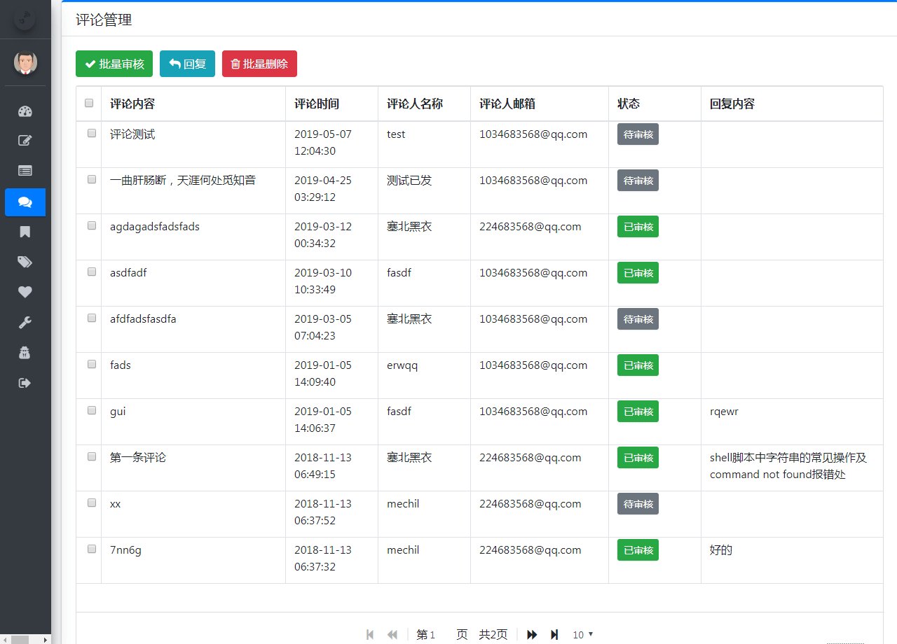

> # My Blog
>
> 
> 
> 
>
> ## 开发文档
>
> ### 《SpringBoot + Mybatis + Thymeleaf 搭建美观实用的个人博客》
>
> ## 联系作者
>
> > 大家有任何问题或者建议都可以在 [issues](https://github.com/ZHENFENG13/My-Blog/issues) 中反馈给我，我会慢慢完善这个项目。
>
> - 我的邮箱：1169970424@qq.com

- 后台管理页面

- 登录页

	

- 后台首页

	

- 文章管理

	

- 文章编辑

	

- 评论管理

	

- 系统配置

	

### 博客展示页面

- 首页

	

- 文章浏览

  

  友情链接

  

- 文章浏览

	

- 友情链接

	

#### 模板三

- 首页

  

- 文章浏览

  

  
